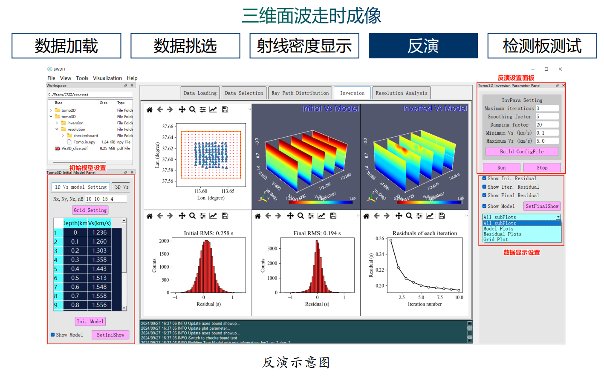

# SWDIT-面波频散反演工具

**SWDIT的发音“swɪdɪt”,中文发音“斯维迪特”**

基于PyQt5设计的面波频散反演交互平台。SWDIT具有三维可视化、半波长解释法、三维面波走时成像等功能。

SWDIT具有三维可视化、半波长解释法、三维面波走时成像等功能,项目地址 https://gitee.com/jhsa920/SWDIT/tree/master

# 工具下载地址 

https://pan.baidu.com/s/1IZ7j0iwPOcjuXmY2D8N5Aw 提取码: 0sf8

- **20250107——进入百度网盘 请下载最新zip压缩包，修复频散加载bug**

|||
|---|---|
|  |  |
|  |  |
|  |  |

#  问题
- 做三维面波走时成像时，当日志中出现rms为NAN的时候，需要将项目中的DSurfTomo-win-2025文件夹下的三个exe文件替换SWDIT安装目录/bin/下的exe文件。
- 三维面波走时成像时，实时的rms与柱状图中的rms统计结果不一致的原因：实时的rms为每次迭代的非加权rms，柱状图中显示的为加权后的rms。
- 三维面波成像反演前后残差柱状图对应的数据为Tomo3D/inversion中的residualFirst.dat和residualLast.dat。
- 三维面波成像反演期间残差随迭代次数变化残差是从Tomo3D/inversion中的Tomo.in.log文件中提取的。
- 三维面波成像反演可使用Linux下的命令行版本，请访问 https://github.com/HongjianFang/DSurfTomo

# 参考文献

如果工具对您的科研有帮助，请引用以下文章

- Fang, H., Yao, H., Zhang, H., Huang, Y. C., & van der Hilst, R. D. (2015). Direct inversion of surface wave dispersion for three-dimensional shallow crustal structure based on ray tracing: methodology and application. Geophysical Journal International, 201(3), 1251-1263. 

- 胡景, 王帅兵, 尚晨奕, 萧羽, 王熠戈, 何雷宇, 邵广周. 基于PyQt5的面波频散曲线成像平台设计与实现
- 胡景, 王华明, 邵广周, 高级等.(2025).小尺度直角坐标系台阵面波走时三维直接成像方法.地球物理学报, doi:10.6038/cjg2024R0566.

